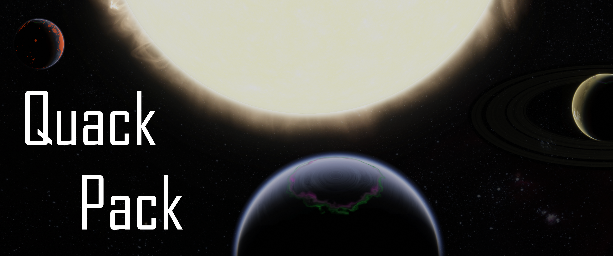

# QuackPack
QuackPack is intended to fill out an often neglected portion of the Kerbolar system: the deep inner system, far below the orbit of Moho.  Oftentimes, when a player has conquered the stock system, it may feel like the only way to access more challenging destinations is to install full system replacers, or interstellar mods.

System expansions such as Outer Planets Mod are a very popular first step, bridging the challenge gap between the stock system and full blown interstellar packs. QuackPack is designed to add an additional level of challenge to a stock + OPM install.  Instead of looking outwards towards other stars, it is time to look inwards towards our own.

These planets are not for the faint of heart.  Transfer requirements are extreme, and their gravity wells are deep.  Gravity assists are a near requirement. Failure lurks around every corner, as the unique thermal environments can cause unexpected problems, or outright destroy craft.  Aerodynamics will work in unusual ways, as the superheated atmospheres are very different from anything else in the Kerbolar system.  However, with smart design, clever planning, and skill, these bodies can be conquered, even fully reusable, or, theoretically, with single stage craft.

## Bodies
* Blas, a metal poor, scorching hot desert Superkerbin with a large ring system and one small moonlet.
* Geet, the lone moon of Blas, and a shepherd to the ring system.
* Jot, an inflated hot Jool with an extremely large atmosphere.
* Cind, a Kerbin sized tidally locked hellworld, with an atmosphere made of sulfur and boiling metal.

## Features
* 4 challenging new bodies to explore.
* Science and career mode ready, with full biome and experiment definitions.
* Full scatterer integration.
* Full EVE integration, with clouds, sandstorms, lightning, aurorae, and thermal glow.
* Planetshine and Distant Object Enhancement integration.

## Notes
* This is my first planet mod, pls be gentle.

## Installation
* Install ALL listed dependencies, following the links bellow
* Download and extract the QuackPack zip file
* Place the GameData folder into your KSP directory

## Requirements
* [ModuleManager](https://forum.kerbalspaceprogram.com/index.php?/topic/50533-18x-112x-module-manager-422-june-18th-2022-the-heatwave-edition/), 4.2.2
* [Kopernicus](https://forum.kerbalspaceprogram.com/index.php?/topic/200143-180-1123-kopernicus-stable-branch-last-updated-august-12th-2022/), 1.12.1-139
* [Kopernicus Expansion EmissiveFX](https://forum.kerbalspaceprogram.com/index.php?/topic/195844-110-111-112-alpha-kopernicus-expansion-continued-er/), Beta 9 - 1.11
* [Community Terrain Texture Pack](https://forum.kerbalspaceprogram.com/index.php?/topic/165873-ksp-15x-community-terrain-textures-pack-104-25-oct-2018/), 1.0.4

## Bundled Dependencies
* [Niako's Kopernicus Utilities](https://forum.kerbalspaceprogram.com/index.php?/topic/207768-112-niakos-kopernicus-utilities-smoother-heightmaps/)
* [Sigma Heat Shifter](https://github.com/Sigma88/Sigma-HeatShifter)

## Provided Compatibility
* [Scatterer](https://forum.kerbalspaceprogram.com/index.php?/topic/103963-wip19x-112x-scatterer-atmospheric-scattering-00838-14082022-scattering-improvements-in-game-atmo-generation-and-multi-sun-support/), v0.0838
* [EVE Redux](https://forum.kerbalspaceprogram.com/index.php?/topic/196411-19-112x-eve-redux-performance-enhanced-eve-maintenance-v11171-09092022/), 1.11.7.1
* [Distant Object Enancement](https://forum.kerbalspaceprogram.com/index.php?/topic/205063-ksp-131-distant-object-enhancement-doe-l-under-new-management-2119-2022-0727/), v2.1.1.9
* [Planetshine](https://forum.kerbalspaceprogram.com/index.php?/topic/173138-112x-planetshine-0266-feb-22-2022/), 0.2.6.6

## Recommended Mods
* [BetterKerbol](https://forum.kerbalspaceprogram.com/index.php?/topic/207389-112x-kopernicus-betterkerbol-v101-a-kerbol-graphics-enhancement/)
* [Outer Planets Mod](https://forum.kerbalspaceprogram.com/index.php?/topic/184789-131-112x-outer-planets-mod-v2210-3rd-jan-2022/)

## Licensing
* QuackPack is licensed by Attribution-NonCommercial-NoDerivs 3.0 Unported (CC BY-NC-ND 3.0)
